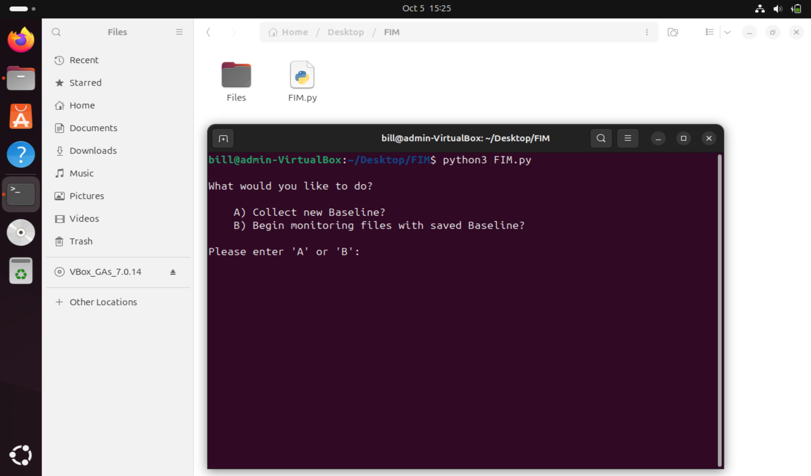
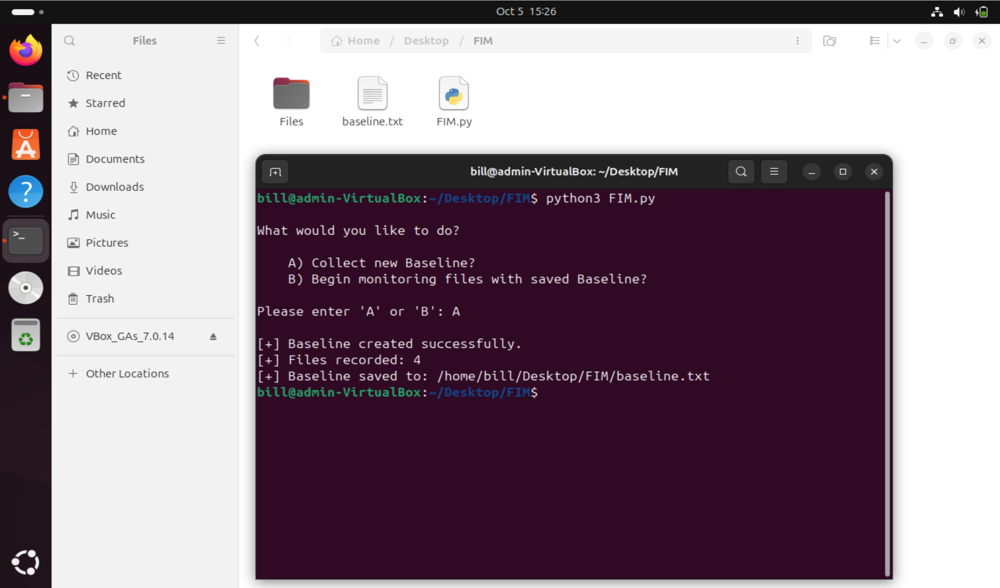
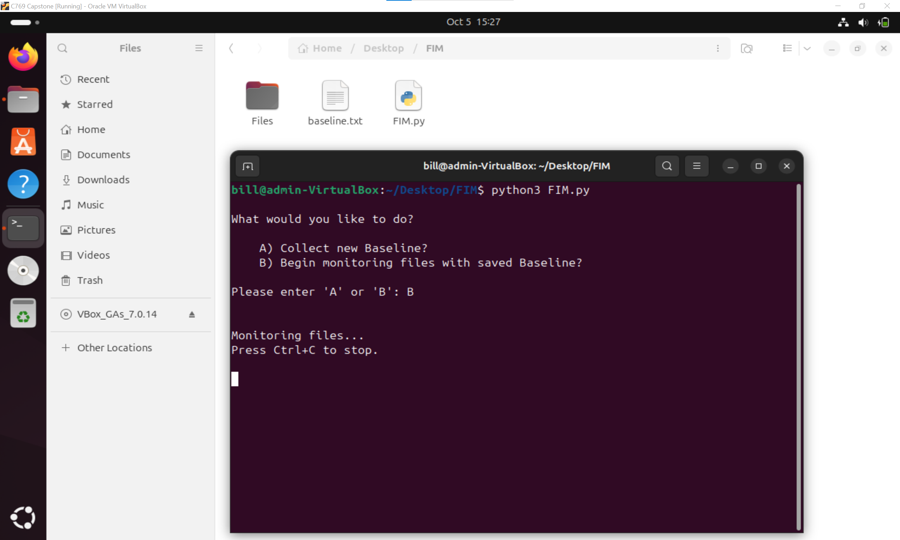
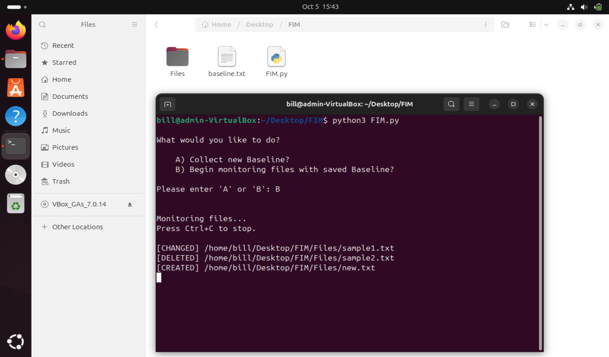

## Demo

### 1. Start the File Integrity Monitor

Run the program and choose whether to create a new baseline or monitor against an existing one.

```bash
python3 FIM.py
```



### 2. Create a Baseline

Option `A` calculates SHA-512 hashes for the files in the `Files` directory and saves them to `baseline.txt`.



### 3. Begin Monitoring

Option `B` continuously compares the monitored files against the saved baseline.



### 4. Detect Integrity Changes

If a monitored file is modified, created, or deleted, the FIM generates an alert.


